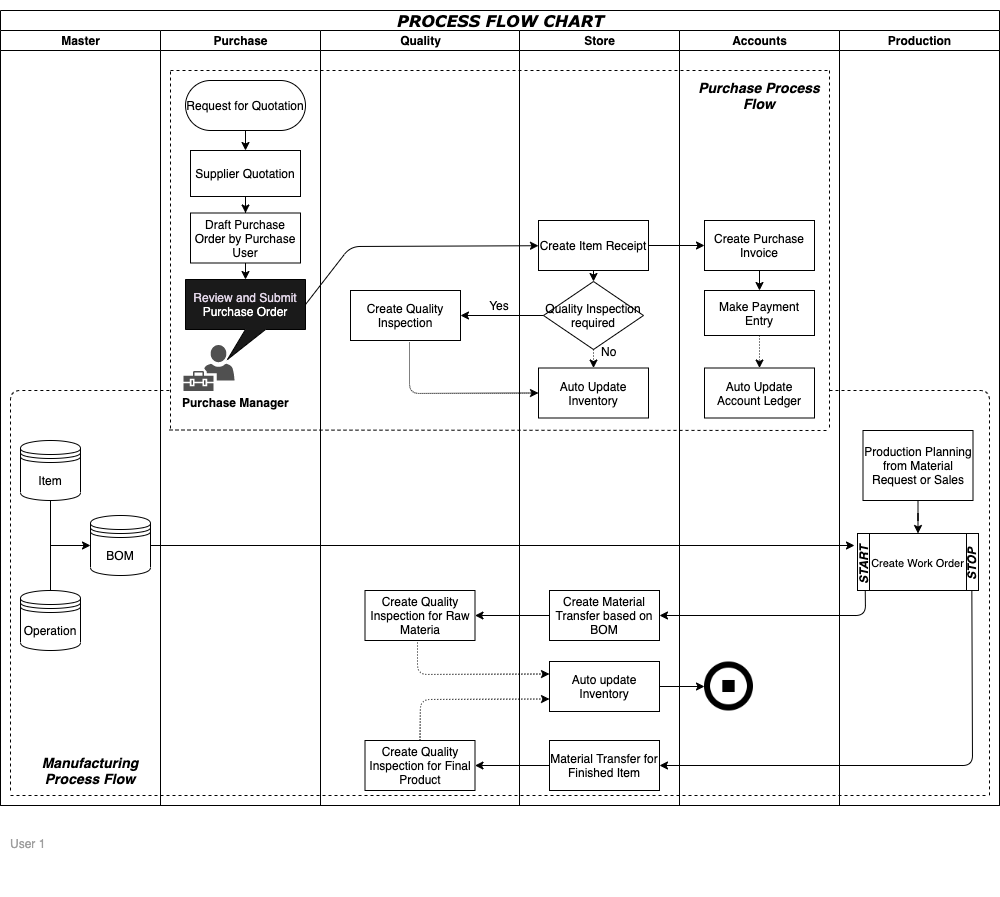
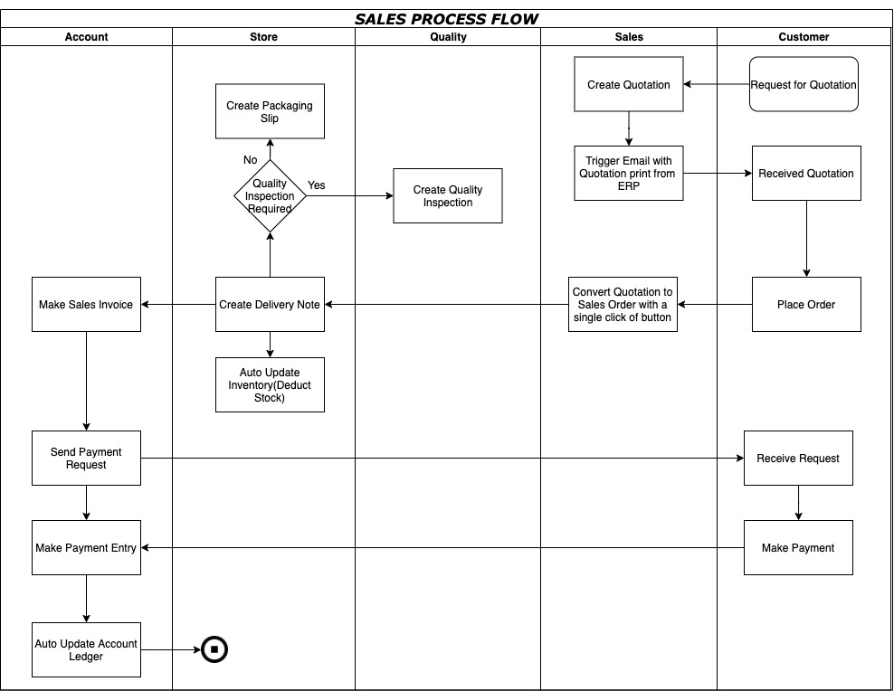

## What is ERP ?

ERP is a software built to manage all business functions on one platform. All the business functions are tied together by linking the relationship between different functions.

## Why before How

Before knowing how to use an ERP, you should know “Why do you want to use an ERP?” The answer to How will depend on Why you want to use it.

Define:

- What is the desired outcome of Implementing an ERP?
- What sort of Reports and/or Dashboards do you want?
- What are the challenges that you would like to overcome?

Some of the major challenges faced by Businesses are:

- **Too much chaos:** Business can be chaotic. Coordination between multiple entities and agencies can be daunting, leading to financial loss or loss of motivation in employees.
- **Delayed Deliveries:** Deliveries get delayed due to various reasons, most common amongst them is coordination between various departments, mainly Production and Sales.
- **Stock Issues:** Overstocking or under-stocking can hamper an organization's profitability and service.
- **Quality Issues:** Quality issues can hamper an organization’s image and even lead to financial loss.

<!--more-->

For designing an efficient business process a company needs to have 3 major things:

1. Centralized Data System
1. Clear Communication Processes
1. Reliable Analytics

## How an ERP can help

An ERP can help by unifying information related to a company coherently which helps businesses solve problems. Behind the scenes working of an ERP can be explained best by the below figure:

### Typical Process Flow

      

### Typical Sales Cycle

      

## How to use an actually use ERP

The best approach while implementing ERP is working backward. Define your Why before you define your How. The following can be used as a guideline:

1. **Define your Desired Output:**
   1. Define the processes and objectives of the business based on which decide the reports and dashboards required to attain the objectives.
   1. Define the modules that will record the required data. If the reports are not ready, prepare the reports in a simple spreadsheet/excel format with the needed headers.
1. **Start Small:** Decide the priority of the various modules and start by implementing one module at a time.
1. **Upload Required Data:** Suppose the company wishes to implement the purchase cycle first it would require to upload :
   1. A few supplier names(3-4 to begin with)
   1. Raw material details like- item code, Item name and unit of measurement
   1. A warehouse where Inventory will be stocked
1. **Simple Configurations:** The next step is to complete all the configurations required to complete one trial circle.
1. **Simulate Trial Cycle:**
   1. Once the configurations are in place simulate a trial cycle with all stakeholders and take note of gaps if any with the current solution provided by the software.
   1. Discuss with an ERP consultant how these gaps can be bridged.
   1. General sequence of Trial Cycle can be as below
      1. Purchase
      1. Sales
      1. Manufacturing
      1. Inventory
      1. Accounting
      1. Support
      1. Human Resource
1. **Simulate all Modules:** The same procedure needs to be repeated for all modules one by one.
1. **Simulate end-to-end Workflow:** Once trial cycles are run for all individual modules, simulate the end-to-end workflow of the company and figure out gaps if any.
1. **Train Users:** Training is the most important aspect of ERP software.
   1. Training ensures there are fewer hindrances in the implementation process. The end-users of the software need to be included in the process as early as possible.
   1. If the end-users do not use the system correctly, the whole purpose of an ERP is defeated.
   1. The users should be trained department or module wise.
   1. Change for any person is hard therefore it should be kept in mind that training should be simple and easy at the beginning. A big bang approach may demoralize the users and jeopardize the adoption.
1. **Review Reports and Dashboard:** Once the complete workflow is reviewed, the reports and dashboards need to be checked to see if anything has been missed out.
1. **Data Migration:** After trial cycles are run and reviewed, the next major and important step is data migration.
   1. All required masters-Item, Customer, Supplier, and Employee need to be loaded
   1. Data migration helps in smooth transitioning and future utilization of the software
   1. **Things to take care during Data Migration is as follows**
      1. **Duplicates:** Make sure there are no duplicates. For example: Customer called Acme Inc cannot be mentioned twice in the Masters. Also Acme Inc with different spellings may exist in the legacy system. This is a good time to remove all duplicates and import correct data to the system. This will improve the reporting.
      1. **Data Completeness:** Make sure all the data is included while migrating the data. Having simple checks like Total number if Customers and tallying it with the imported data will ensure complete data is migrated.
      1. **Data Integrity:** This is important for data that involves financials and other numerical values that need to tally based on the business logic. Check your Accounting data for integrity by applying simple checks to make sure the data being migrated is correct
      1. **Dependencies:** Make sure the data is migrated in the right order. For example: Item Master needs to be imported before Bill of Material (BOM) can be uploaded
1. **Parallel Run:** Parallel run is a very important step in the ERP implementation process.
   1. Once the users have been trained, the company should parallel run the new ERP system with the legacy system for at least 15 days
   1. This will give users a real-life practical experience of the software and a chance to figure out any edge cases that may have been missed out
   1. Things to keep in mind for parallel run are as follows
      1. **Don’t be stuck with the way your software should work.** Try to work with the software as it is unless it is a show-stopper. Making changes to software can be time and cost consuming
      1. **Don’t try to address the most complex scenarios first,** thinking complex scenarios will take care of simple ones as well. You will end up confusing yourself and the Implementation team. Try adding complexity gradually and tackle it smartly with your Implementation team’s advice
      1. **Don’t treat Parallel Run as a side project.** This is as critical as your daily operations. An ERP is going to be a mission critical part of your organization once it goes live. It’s success depends highly on its adaption by the user and thus parallel run is equally important. **Take out one hour per day for practice.**
1. **Go-live Preparation:** Once the ERP solution is properly reviewed, it is time to go live.
   1. In this phase, a new instance with the latest Masters, Opening Balances, and Configuration is prepared for go-live
   1. A final set of testing on Live instance is performed before going live
   1. In order to plan a smooth Go-Live, it is important to allocate at least 2 weeks to this phase

An ERP solution is not a one-time event, but rather a continuous process.Therefore reports and dashboards need to be reviewed on a regular basis to make sure the implementation is achieving its desired outcomes.
